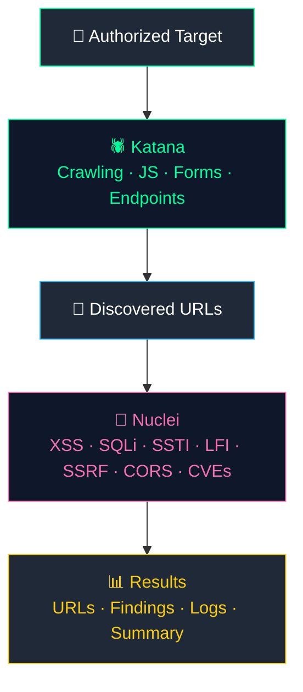

<div align="center">


<br>

<pre>
██╗    ██╗███████╗██████╗      █████╗ ██╗   ██╗██████╗ ██╗████████╗
██║    ██║██╔════╝██╔══██╗    ██╔══██╗██║   ██║██╔══██╗██║╚══██╔══╝
██║ █╗ ██║█████╗  ██████╔╝    ███████║██║   ██║██║  ██║██║   ██║
██║███╗██║██╔══╝  ██╔══██╗    ██╔══██║██║   ██║██║  ██║██║   ██║
╚███╔███╔╝███████╗██████╔╝    ██╔══██║╚██████╔╝██████╔╝██║   ██║
 ╚══╝╚══╝ ╚══════╝╚═════╝     ╚═╝  ╚═╝ ╚═════╝ ╚═════╝ ╚═╝   ╚═╝
</pre>

**Automated Web Security Auditing — Katana + Nuclei + Bash**

<p>
  
  
  
  
</p>

<p>
  
  
  
  
</p>

<p>
  <a href="#-instalación">🚀 Installation</a> •
  <a href="#-uso">📖 Usage</a> •
  <a href="#-features">🔎 Features</a> •
  <a href="#-resultados">📂 Results</a> •
  <a href="#-disclaimer-legal">⚠️ Legal</a>
</p>

</div>

---

## 🛡️ Sobre el proyecto

**Web Audit — Katana + Nuclei** es un framework de automatización en Bash creado por **Henry Molina** para realizar evaluaciones iniciales de seguridad web en entornos autorizados.

El proyecto combina herramientas del ecosistema **ProjectDiscovery** en un flujo simple:



> El objetivo **no es reemplazar** un pentest completo, sino ofrecer un punto de partida ágil para reconocimiento y detección automatizada de vulnerabilidades.

---

## ✨ Features

| Feature | Descripción |
|---|---|
| 🕷️ **Katana Crawling** | Descubre URLs y endpoints |
| 🎯 **Domain Scope** | Mantiene el crawling dentro del dominio raíz + subdominios |
| 📜 **JavaScript Crawling** | Analiza recursos JavaScript |
| 📝 **Form Extraction** | Extrae formularios y campos de entrada |
| 🧪 **Nuclei Scanning** | Ejecuta checks de seguridad basados en templates |
| 🎯 **Modular Scans** | Selección de categorías individuales de vulnerabilidad |
| 📁 **Automatic Reports** | Organiza resultados por target y timestamp |
| 📊 **Summary** | Genera un resumen simple de la auditoría |
| 🔧 **Auto Installer** | Instala las herramientas requeridas |
| 🔄 **Auto Updates** | Actualiza herramientas y templates de ProjectDiscovery |
| 🖥️ **Interactive CLI** | Menú de terminal simple |

---

## 🔎 ¿Qué escanea?

<div align="center">

| # | Módulo | Descripción |
|:-:|---|---|
| 01 | 🟥 **XSS** | Cross-Site Scripting |
| 02 | 🟧 **SQLi** | SQL Injection |
| 03 | 🟨 **SSTI** | Server-Side Template Injection |
| 04 | 🟩 **LFI** | Local File Inclusion |
| 05 | 🟦 **SSRF** | Server-Side Request Forgery |
| 06 | 🟪 **CORS** | Chequeos de CORS |
| 07 | ⬜ **Headers** | Cabeceras HTTP |
| 08 | 🟫 **Exposure** | Detección de exposición de datos |
| 09 | 🔺 **CVE** | Vulnerabilidades conocidas |
| 10 | 🔻 **Misconfiguration** | Malas configuraciones |
| 11 | ⚪ **General** | Templates generales |

</div>

---

## 🎯 Gestión de alcance (Scope)

Una parte clave del proyecto es controlar el scope del crawling. Katana se ejecuta con:

```bash
-fs rdn
```

Esto mantiene el crawler dentro del **dominio raíz y sus subdominios**:

```
example.com
├── www.example.com
├── app.example.com
├── api.example.com
├── dev.example.com
├── staging.example.com
└── admin.example.com
```

Los dominios externos referenciados por la aplicación (`google.com`, `microsoft.com`, `w3.org`, `cloudflare.com`, etc.) **no** entran en el scope del crawling. Muy útil para apps que cargan recursos de múltiples servicios de terceros.

---

## 🧰 Tecnologías

<div align="center">

| Herramienta | Uso |
|---|---|
| 🕷️ **[Katana](https://github.com/projectdiscovery/katana)** | Crawler web de alta velocidad — descubrimiento de endpoints, URLs, JS y formularios |
| 🧪 **[Nuclei](https://github.com/projectdiscovery/nuclei)** | Scanner de vulnerabilidades basado en templates — CVEs, misconfigs, exposición |
| 🌐 **[HTTPX](https://github.com/projectdiscovery/httpx)** | Toolkit HTTP auxiliar, integración planeada a futuro |
| 🐚 **Bash** | Capa completa de automatización |

</div>

---

## 💻 Requisitos

**Sistema operativo:** Linux (recomendado: **Kali Linux**)

<details>
<summary>📋 Distribuciones soportadas</summary>

- Debian
- Ubuntu
- Linux Mint
- Pop!_OS
- Fedora
- RHEL
- CentOS
- Rocky Linux
- AlmaLinux
- Arch Linux
- Manjaro

</details>

**Dependencias:** Bash, Git, Go, Curl, Wget, ca-certificates, build tools, conexión a internet.

> El script puede instalar automáticamente las dependencias principales en distribuciones soportadas.

---

## 🚀 Instalación

**1. Clona el repositorio**

```bash
git clone https://github.com/henrylandia/WebAudit-Katana-Nuclei.git
cd WebAudit-Katana-Nuclei
```

**2. Da permisos de ejecución**

```bash
chmod +x web-audit.sh
```

**3. Valida el script**

```bash
bash -n web-audit.sh
```

Si no hay output, el chequeo de sintaxis pasó ✅

**4. Inicia Web Audit**

```bash
./web-audit.sh
# o
bash web-audit.sh
```

---

## 🛠️ Primer uso

Al ejecutar Web Audit por primera vez, selecciona:

```
2) Instalar todas las dependencias
```

El instalador configura:

- ✅ Dependencias del sistema
- ✅ Go
- ✅ Katana
- ✅ Nuclei
- ✅ HTTPX
- ✅ Nuclei Templates

Los binarios de Go se instalan en `$HOME/go/bin` y el script configura el `PATH` del usuario.

---

## 📋 Menú principal

```text
============================================================
                 WEB AUDIT - KATANA + NUCLEI
============================================================

Directorio de auditorías:
  /home/user/web-audits

1) Nueva auditoría web
2) Instalar todas las dependencias
3) Comprobar herramientas
4) Actualizar herramientas y templates
5) Ver auditorías anteriores
0) Salir
```

---

## 🔍 Uso

### Paso 1 — Iniciar una nueva auditoría

```
1) Nueva auditoría web
```

El script pide el target:

```
URL objetivo:
```

Ejemplo: `https://app.example.com`

> Si escribes `app.example.com` sin protocolo, el script lo normaliza automáticamente a `https://app.example.com`

### Paso 2 — Profundidad de crawling

Profundidad por defecto: **5**

```
Profundidad de Katana [5]:
```

Ajústala según el tamaño y complejidad de la aplicación. Mayor profundidad = más requests y más URLs.

### Paso 3 — Katana

```bash
katana \
    -u TARGET \
    -fs rdn \
    -d DEPTH \
    -jc \
    -fx
```

| Parámetro | Propósito |
|---|---|
| `-u` | URL objetivo |
| `-fs rdn` | Dominio raíz + subdominios |
| `-d` | Profundidad de crawling |
| `-jc` | JavaScript crawling |
| `-fx` | Extracción de formularios |

### Paso 4 — Recolección de URLs

Katana genera el output crudo en `urls-raw.txt`. El script procesa y genera `urls.txt` con URLs únicas, y guarda el conteo en `url-count.txt`.

### Paso 5 — Nuclei

```
1) XSS
2) SQLi
3) SSTI
4) LFI
5) SSRF
6) CORS
7) Headers
8) Exposure
9) CVE
10) Misconfiguration
11) General
12) TODOS
0) Omitir Nuclei
```

Puedes correr un solo módulo o todos.

---

## 📂 Resultados

Cada auditoría se guarda por separado en `~/web-audits/`:

```
web-audits/
└── app.example.com_20260907_153000/
    ├── TARGET.txt
    ├── urls-raw.txt
    ├── urls.txt
    ├── url-count.txt
    ├── katana.log
    ├── SUMMARY.txt
    │
    └── nuclei/
        ├── xss.txt / xss.log
        ├── sqli.txt / sqli.log
        ├── ssti.txt / ssti.log
        ├── lfi.txt / lfi.log
        ├── ssrf.txt / ssrf.log
        ├── cors.txt / cors.log
        ├── headers.txt / headers.log
        ├── exposure.txt / exposure.log
        ├── cve.txt / cve.log
        ├── misconfig.txt / misconfig.log
        └── general.txt / general.log
```

### 📊 SUMMARY.txt

Al finalizar la auditoría, Web Audit genera un `SUMMARY.txt` con:

- Target
- Hostname
- Fecha
- Número de URLs
- Resultados de Nuclei
- Directorio de salida

---

## 🔄 Actualizar herramientas

Desde el menú principal:

```
4) Actualizar herramientas y templates
```

O manualmente:

```bash
nuclei -update-templates
```

---

## 🔧 Troubleshooting

<details>
<summary><b>Permission denied</b></summary>

```bash
chmod +x web-audit.sh
```

</details>

<details>
<summary><b>Bash syntax error</b></summary>

```bash
bash -n web-audit.sh
```

</details>

<details>
<summary><b>Katana not found</b></summary>

```bash
ls -la "$HOME/go/bin/katana"
export PATH="$HOME/go/bin:$PATH"
```

</details>

<details>
<summary><b>Nuclei not found</b></summary>

```bash
ls -la "$HOME/go/bin/nuclei"
export PATH="$HOME/go/bin:$PATH"
```

</details>

<details>
<summary><b>Comprobar herramientas instaladas</b></summary>

```bash
katana -version
nuclei -version
httpx -version
```

</details>

---

## ⚠️ Limitaciones

Web Audit está diseñado para una **evaluación automatizada inicial**. No reemplaza un pentest manual ni una evaluación completa de seguridad de aplicaciones.

El crawling automatizado y el escaneo por templates puede pasar por alto vulnerabilidades relacionadas con:

- Autenticación y autorización
- Lógica de negocio
- Flujos y transacciones multi-paso
- APIs JSON / GraphQL / WebSockets
- Funcionalidad dependiente de sesión
- Vulnerabilidades del lado del cliente
- Lógica custom de la aplicación
- Vulnerabilidades sin template existente en Nuclei

> **Un escaneo limpio no significa que la aplicación sea segura.**

---

## 🔐 Disclaimer legal

<div align="center">

### ⚠️ Uso autorizado únicamente ⚠️

</div>

Este software está pensado exclusivamente para:

- ✅ Tus propias aplicaciones
- ✅ Pentesting autorizado
- ✅ Laboratorios de seguridad
- ✅ Entornos CTF
- ✅ Entornos de desarrollo y staging
- ✅ Sistemas con permiso explícito

**No escanees infraestructura de terceros sin autorización.**

El autor, Henry Molina, no se hace responsable del mal uso de este software ni de daños causados por pruebas no autorizadas. Al usar este proyecto aceptas la responsabilidad de garantizar que tus actividades cumplen con las leyes, regulaciones, contratos y límites de autorización aplicables.

---

## 🚧 Roadmap

- [ ] Verificación de hosts vivos con HTTPX
- [ ] Soporte multi-target
- [ ] Enumeración de subdominios
- [ ] Filtrado de URLs mejorado
- [ ] Reportes HTML / JSON / CSV
- [ ] Estadísticas de vulnerabilidades
- [ ] Soporte de autenticación
- [ ] Templates de Nuclei personalizados
- [ ] Archivo de configuración
- [ ] Directorio de salida personalizable
- [ ] Logging mejorado
- [ ] Escaneo en paralelo
- [ ] Más integraciones con ProjectDiscovery
- [ ] Dashboard web

---

## 🤝 Contribuir

¡Contribuciones, reportes de bugs y sugerencias son bienvenidas!

```bash
git clone https://github.com/henrylandia/WebAudit-Katana-Nuclei.git
cd WebAudit-Katana-Nuclei
git checkout -b feature/my-feature

# haz tus cambios y valida
bash -n web-audit.sh

git add .
git commit -m "Add my feature"
git push origin feature/my-feature
```

Luego abre un **Pull Request** en GitHub.

---

## ⭐ Apoya el proyecto

Si **Web Audit — Katana + Nuclei** te resulta útil:

⭐ Dale una estrella al repo · 🐛 Reporta bugs · 💡 Sugiere mejoras · 🔧 Envía Pull Requests

**Repositorio:** [github.com/henrylandia/WebAudit-Katana-Nuclei](https://github.com/henrylandia/WebAudit-Katana-Nuclei)

---

<div align="center">

## 👨‍💻 Autor

**Henry Molina**
*Security Researcher / Developer*

[](https://github.com/henrylandia)

### 📜 Licencia

Este proyecto está bajo la **Licencia MIT** — ver [LICENSE](LICENSE) para el texto completo.

<br>

```
╔══════════════════════════════════════════════════════════╗
║             WEB AUDIT — KATANA + NUCLEI                  ║
║       Authorized Security Testing & Research              ║
╚══════════════════════════════════════════════════════════╝
```

**Built with ❤️ and Bash by Henry Molina**

⭐ *Star the repo if you find it useful!*

</div>
